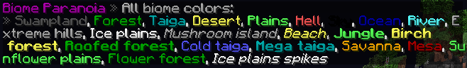

# BiomeParanoia

**Scenario by:** [Wingnut45](https://www.reddit.com/u/Wingnut45)

**Description:**

When players are in a different biome their name will turn a certain color on tab.

If the color goes away when it is set make sure you don't have any other plugins that modify the tablist

___

**Commands:**

/bparanoia enable - *Enable the scenario.*

/bparanoia disable - *Disable the scenario.*

/bparanoia setcolor <biome> <color> - *Set the color for the given biome to the given color.*

/bl - *View a list of all the biome colors*

**Permissions:**

*bparanoia.manage* - Permission to use /bparanoia

/bl has no permission however you can't use it if the scenario is disabled.
___

**Default Biome colors:**

___

**Configuration**

The configuration contains all the biomes that are in /bl int he form: "[biomename]: [color]"

The color codes are &[colornumber] and it supports multiple colors, All color codes can be found [here](http://minecraft.gamepedia.com/Formatting_codes)

___
[Download](https://github.com/LeonTG77/BiomeParanoia/releases)

*This has been tested on the latest spigot 1.8 build but it ^^should work in 1.7*
